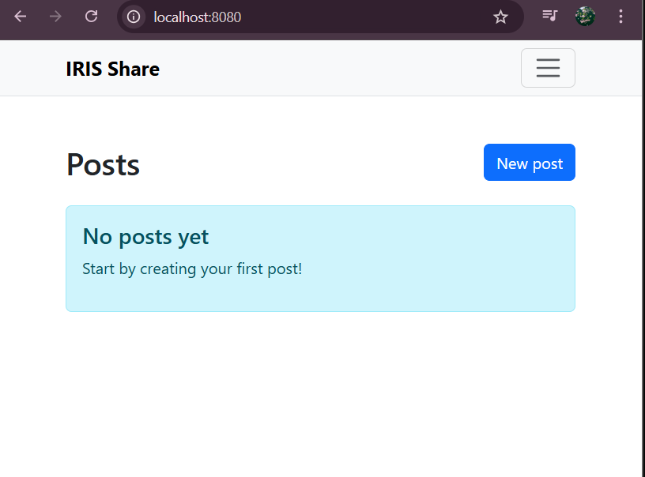

## Task 2 – Run Rails & Database in Separate Containers

### Objective
The objective of Task 2 was to separate the Rails application and MySQL database into independent Docker containers and establish proper inter-container communication. This ensures service isolation, improved scalability, and adherence to containerized deployment best practices.

### Initial Docker Compose Setup

A docker-compose.yml file was introduced to orchestrate multiple services. Two containers were defined:

db_cont – running MySQL 8.0  
serv_cont – running the Rails application  

The MySQL container was configured with environment variables such as:

`MYSQL_ROOT_PASSWORD`  
`MYSQL_DATABASE`  

A named Docker volume `db_data` was attached to persist database data at `/var/lib/mysql`.

The Rails container exposed port `8080:3000` and was configured to depend on the database container using `depends_on`.

This setup ensured both containers were started together, but it did not yet guarantee successful database connectivity.

### Runtime Error – Database Connection Failure

After launching the containers, the Rails application failed with:

ActiveRecord::ConnectionNotEstablished  
"Can't connect to local server through socket '/var/run/mysqld/mysqld.sock'"

This error occurred because Rails was still attempting to connect via a local UNIX socket instead of connecting to the MySQL container over the Docker network.

This highlighted an important concept in containerized environments: services must communicate using Docker service names as hostnames rather than relying on local socket-based connections.

### Updating database.yml to Use Environment Variables

To resolve this issue, the `database.yml` file was modified to dynamically fetch connection details from environment variables.

Instead of hardcoding values, the following configuration was introduced:

host: `<%= ENV["DB_HOST"] %>`  
username: `<%= ENV["DB_USER"] %>`  
password: `<%= ENV["DB_PASSWORD"] %>`  
database: `<%= ENV["DB_NAME"] %>`  

This allowed the Rails container to connect to the MySQL container using the Docker service name (`db_cont`) as the host.

This approach follows Twelve-Factor App principles and ensures that configuration is environment-driven rather than hardcoded inside the application.

### Running Migrations Inside the Container

After resolving the connection issue, another runtime error indicated pending migrations.

To fix this, migrations were executed inside the Rails container using:

docker compose exec serv_cont rails db:migrate

After running migrations:

- Required tables were created  
- Schema was updated  
- Database structure became synchronized with the application  

This ensured the application database was fully initialized within the containerized environment.

### Successful Application Startup

After correcting the environment configuration and running migrations, the Rails application successfully connected to the MySQL container.

The application became accessible at:

http://localhost:8080

The homepage loaded correctly, confirming that:

- Containers were communicating successfully  
- Database connection was properly established  
- Environment variables were functioning as expected  

